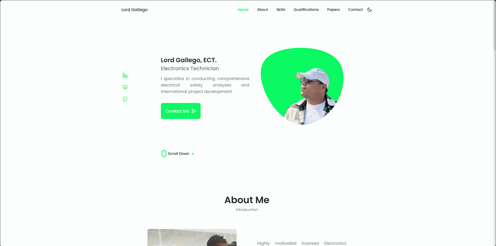
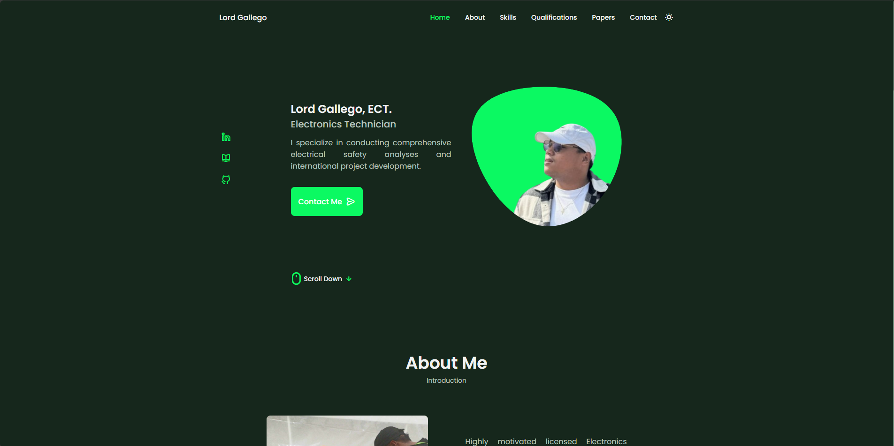

# Lord Gallego's Responsive Portfolio Website

## Website URL: https://lordgallego.vercel.app

<!-- - The design is based on [Bedimcode](https://github.com/bedimcode) -->

- Icons are from [Iconify](https://icon-sets.iconify.design/uil/brackets-curly/)
- The email service provider is [Formspree](https://formspree.io/)
- Contact form validations are added using [JavaScript](https://www.youtube.com/watch?v=fz8bwvn9lA4)
- Normal alerts are replaced with Sweet Alert [SweetAlert](https://sweetalert.js.org)
- The favicon generator is [favicon.io](https://favicon.io/favicon-generator/)
- The Open Graph Meta Tags are added [Open Graph](https://ogp.me/)
  <!-- - Videos are embedded from [YouTube](https://www.youtube.com) -->
  <!-- - Presentations are embedded from [Beautiful.ai](https://www.beautiful.ai) -->
- Added Google Tag script for [Google Analytics](https://analytics.google.com)
- Online meeting integration is from [Calendly](https://calendly.com/)
<!-- - Chatbot integration is from [Crisp](https://crisp.chat/en/) -->

### Landing Page Light

### Landing Page Dark

